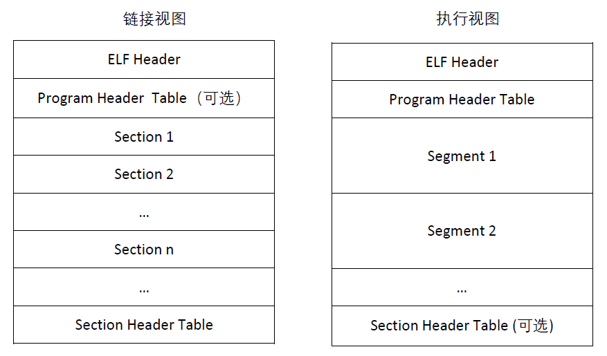

[toc]

该文件定义了ELF可执行文件的格式。该文件中没有关于*Section header*的定义。

一个ELF二进制文件由一个ELF头部（struct elfhdr）和紧随其后的“程序部分”头部序列（struct proghdr）。



（图片来源https://zhuanlan.zhihu.com/p/73114831）


# elfhdr

ELF头部

```c
struct elfhdr {
  uint magic;  // ELF文件的魔术字段，即ELF文件的标识符。
  uchar elf[12];  // other info
  ushort type;  // 目标文件类型
  ushort machine;  // 架构
  uint version;  // 目标文件版本
  uint entry;  // 入口点的虚拟地址
  uint phoff;  // program header table file offset
  uint shoff;  // Section header table file offset 
  uint flags;  // 处理器特定标志
  ushort ehsize;  // elfhdr大小
  ushort phentsize;  // Program header table entry size
  ushort phnum;  // Program header table entry count
  ushort shentsize;  // Section header table entry size
  ushort shnum;  // Section header table entry count 
  ushort shstrndx;  // Section header string table index
};
```


# proghdr

程序部分的头部

```c
struct proghdr {
  uint type;  // 细分类型
  uint off;  // 该文件的起始位置，即该段的第一个字节所在的位置的偏移量
  uint vaddr;  // 段的第一个字节驻留在内存中的虚拟地址
  uint paddr;  // 与物理寻址相关的系统段物理地址
  uint filesz;  // 段中文件镜像的比特数
  uint memsz;  // 段中内存镜像的比特数
  uint flags;  // 段中的标志位
  uint align;  // 对齐
};
```


## 程序段相关的常量

```c
// Values for Proghdr type
#define ELF_PROG_LOAD           1

// Flag bits for Proghdr flags
#define ELF_PROG_FLAG_EXEC      1
#define ELF_PROG_FLAG_WRITE     2
#define ELF_PROG_FLAG_READ      4
```