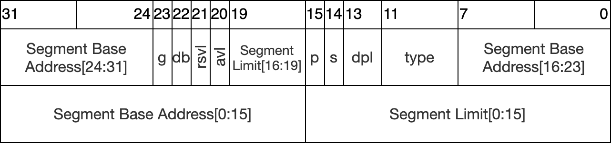

[toc]

该文件（X86 Memory Manager Unit）主要定义了内存管理相关的变量、函数或宏。

虚地址模型如下：

```c
// A virtual address 'la' has a three-part structure as follows:
//
// +--------10------+-------10-------+---------12----------+
// | Page Directory |   Page Table   | Offset within Page  |
// |      Index     |      Index     |                     |
// +----------------+----------------+---------------------+
//  \--- PDX(va) --/ \--- PTX(va) --/
```

1. 最高10位为页目录，即二级页表
2. 次高10位为页表
3. 低12位为页内偏移

（段模型参见*Segment Descriptor*）


# PGROUNDUP和PGROUNDDOWN

其实现原理

```c
#define PGROUNDUP(sz)  (((sz)+PGSIZE-1) & ~(PGSIZE-1))
#define PGROUNDDOWN(a) (((a)) & ~(PGSIZE-1))
```


这两个宏的作用分别是获取页的上界和页的下界。

* PGROUNDDOWN的做法是直接舍去低位，因此可以获取页的下界。如传入5000，则`PGROUNDDOWN(5000) == 4096`。
* PGROUNDUP采取了类似的做法，但是由于其先执行了`(sz)+PGSIZE-1`，对高位进行了+1的操作，因此获得了页的上界，也即`PGROUNDDOWN(a) + PGSIZE`。如传入5000，则`PGROUNDUP(5000) == 8192`。


# segdesc / Segment Descriptor

段描述符的结构定义，因为这里段的设计参照了x86中常见的段设计方式，所以各字段解释[参考资料](https://en.wikipedia.org/wiki/Segment_descriptor)


段结构图如下（方括号中的范围指对于该字段的位数位置）：

（勘误，图中的rsvl错误，应是rsv1）

```c
struct segdesc {
  uint lim_15_0 : 16;  // Low bits of segment limit
  uint base_15_0 : 16; // Low bits of segment base address
  uint base_23_16 : 8; // Middle bits of segment base address
  uint type : 4;       // Segment type (see STS_ constants)
  uint s : 1;          // 0 = system, 1 = application
  uint dpl : 2;        // Descriptor Privilege Level
  uint p : 1;          // Present
  uint lim_19_16 : 4;  // High bits of segment limit
  uint avl : 1;        // Unused (available for software use)
  uint rsv1 : 1;       // Reserved
  uint db : 1;         // 0 = 16-bit segment, 1 = 32-bit segment
  uint g : 1;          // Granularity: limit scaled by 4K when set
  uint base_31_24 : 8; // High bits of segment base address
};
```

（这里涉及了一个C语言的少见用法，指定结构体内各个数据所占用的位数，[参考资料](https://blog.csdn.net/sigh667/article/details/78584749)）

* segment base address（32 bit）：段内存基址
* segment limit（20 bit）：这里存储的是最后一个可访问数据的地址。它的含义会受到G标志位的影响
* g = granularity（1 bit）：粒度。如果该值为0（clear），则limit是以字节为单位；如果为1（set），则limit是以页为单位（4096 bytes）。

* D / B = Default operand size / Big（1 bit）：如果为0，最大数据段偏移为16 bit；如果为1，最大数据段偏移为32 bit
* type：段类型。具体见以*STS_*开头的常量
* s：区分这是一个系统段，还是一个用户段
* dpl：段特权级别
* p：段存在内存的标志。如果为0，任何对该段的引用都会产生“段不存在”的错误
* avl：硬件会忽略这一位，因此该位供软件使用
* rsv1：（该位的用法还不清楚）


# taskstate / Task state segment（TSS）

```c
struct taskstate {
  uint link;         // Old ts selector
  uint esp0;         // Stack pointers and segment selectors
  ushort ss0;        //   after an increase in privilege level
  ushort padding1;
  uint *esp1;
  ushort ss1;
  ushort padding2;
  uint *esp2;
  ushort ss2;
  ushort padding3;
  void *cr3;         // Page directory base
  uint *eip;         // Saved state from last task switch
  uint eflags;
  uint eax;          // More saved state (registers)
  uint ecx;
  uint edx;
  uint ebx;
  uint *esp;
  uint *ebp;
  uint esi;
  uint edi;
  ushort es;         // Even more saved state (segment selectors)
  ushort padding4;
  ushort cs;
  ushort padding5;
  ushort ss;
  ushort padding6;
  ushort ds;
  ushort padding7;
  ushort fs;
  ushort padding8;
  ushort gs;
  ushort padding9;
  ushort ldt;
  ushort padding10;
  ushort t;          // Trap on task switch
  ushort iomb;       // I/O map base address
};
```