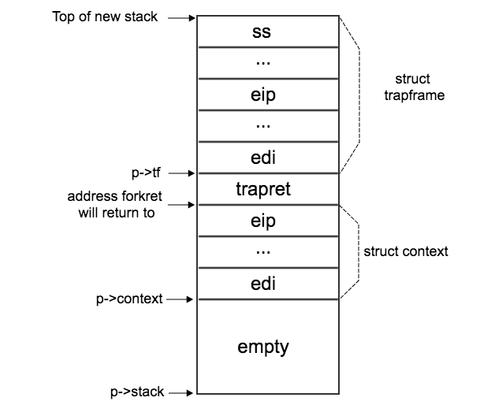

[toc]

该文件主要分为CPU、进程以及二者共有的结构三个部分。

# cpu

CPU的数据结构

```c
struct cpu {
  uchar id;                    // Local APIC ID; index into cpus[] below
  struct context *scheduler;   // swtch() here to enter scheduler
  struct taskstate ts;         // Used by x86 to find stack for interrupt
  struct segdesc gdt[NSEGS];   // x86 global descriptor table
  volatile uint started;       // Has the CPU started?
  int ncli;                    // Depth of pushcli nesting.
  int intena;                  // Were interrupts enabled before pushcli?
  
  // Cpu-local storage variables; see below
  struct cpu *cpu;
  struct proc *proc;           // The currently-running process.
};
```

* *id*：可以看到每个CPU拥有一个唯一的*id*标识符

* *scheduler*：调度器变量，其数据结构是context结构体

* *gdt*：全局描述符，其数据结构是段描述符。（常量*NSEGS*的值是7）

  这个变量的存在，与内存寻址的方式有关。为了考虑兼容性，CPU分为了实模式和保护模式两种方式。在实模式下，寻址方式为`物理地址 = (段地址 << 4) + offset `；而保护模式下，则是通过gdt来获取段的基址 + offset。

* *started*：这个变量本身没什么好谈论的。但是修饰它的**volatile**关键字，具有一些特殊的作用。

  被 `volatile` 修饰的变量，在对其进行读写操作时，会引发一些**可观测的副作用**（硬件状态的修改）。而这些可观测的副作用，是由程序之外的因素决定的。[参考资料](https://liam.page/2018/01/18/volatile-in-C-and-Cpp/)

* *ncli*：主要用于记录pushcli的深度。该值大于0，则说明pushcli次数大于popcli；小于0，则相反。
* *intena*：用于记录中断的初始状态，即`ncli == 0`时的中断状态。
* *cpu*：指向当前的CPU（用途还不是很明确）
* *proc*：当前执行的进程


# gs寄存器

这是一个特性，告诉gcc编译器使用`%gs:0`引用cpu，使用`%gs:4`引用proc。

段初始化函数*seginit*会设置gs段寄存器，因此gs可以引用在本地CPU的cpu结构体中的如下两个变量的内存。

```c
extern struct cpu *cpu asm("%gs:0");       // &cpus[cpunum()]
extern struct proc *proc asm("%gs:4");     // cpus[cpunum()].proc
```

关于gs的讨论可以参见stack overflow上的帖子[What is the “FS”/“GS” register intended for?](https://stackoverflow.com/questions/10810203/what-is-the-fs-gs-register-intended-for)

简单来说就是，gs寄存器的存在不是CPU所提供的特性，而是由操作系统所定义的。在Windows下，gs用于管理线程下特定内存；在Linux下，gs用于访问CPU特定的内存。


# context

存储用于内核上下文切换的寄存器。

* 不必存储所有的段寄存器（*%cs*），有些寄存器存储的是上下文中的常量。
* 也不必存储诸如*%eax、%ecx、%edx*等寄存器，因为x86约定调用者（caller）来存储它们。
* 上下文存储在栈底，因此可以使用栈底指针来访问上下文
* 该结构的元素分布是与*switch.S*中的栈元素部分严格一致
* Switch不会显式存储eip寄存器，但是它在栈中并且被*allocproc*函数操作

```c
struct context {
  uint edi;
  uint esi;
  uint ebx;
  uint ebp;
  uint eip;
};
```


#proc

进程状态：

* UNUSED：表示进程未被创建
* EMBRYO：进程刚被初始化
* SLEEPING：阻塞
* RUNNABLE：就绪
* RUNNING：执行
* ZOMBIE：结束/僵死

```c
enum procstate { UNUSED, EMBRYO, SLEEPING, RUNNABLE, RUNNING, ZOMBIE };

// Per-process state
struct proc {
  uint sz;                     // Size of process memory (bytes)
  pde_t* pgdir;                // Page table
  char *kstack;                // Bottom of kernel stack for this process
  enum procstate state;        // Process state
  volatile int pid;            // Process ID
  struct proc *parent;         // Parent process
  struct trapframe *tf;        // Trap frame for current syscall
  struct context *context;     // swtch() here to run process
  void *chan;                  // If non-zero, sleeping on chan
  int killed;                  // If non-zero, have been killed
  struct file *ofile[NOFILE];  // Open files
  struct inode *cwd;           // Current directory
  char name[16];               // Process name (debugging)
};
```


根据allocproc函数的描述可以了解到进程栈的内存分布（[图片来源](http://linbo.github.io/2018/04/14/xv6-first_process_1)）：



