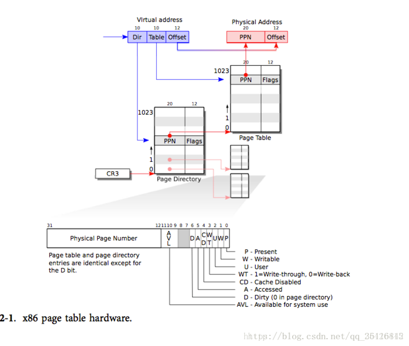

[toc]

# 内存模型（待补充）


| 虚拟地址                                                   | 物理地址                   | 用途                             |
| ---------------------------------------------------------- | -------------------------- | -------------------------------- |
| 0 ... KERNBASE（0x80000000）「0 ... 2GB」                  | 由内核分配                 | 用户空间（text+data+stack+heap） |
| KERNBASE..KERNBASE+EXTMEM（0x100000）「2GB ... 2GB + 1MB」 | 0 ... 0x100000             | I/O space                        |
| 0x80100000 ... 0x80000000+data                             | 0x100000 ... data          | 内核代码和只读数据               |
| 0x80000000+data ... 0x80E00000                             | data ... 0xE00000(PHYSTOP) | 内核数据+可用物理内存            |
| 0xFE000000 ... 0                                           | 0xFE000000(DEVSPACE) ... 0 | 其他通过内存映射的I/O设备        |


# kmap

```c
static struct kmap {
  void *virt;
  uint phys_start;
  uint phys_end;
  int perm;
} kmap[] = {
 { (void*)KERNBASE, 0,             EXTMEM,    PTE_W}, // I/O space
 { (void*)KERNLINK, V2P(KERNLINK), V2P(data), 0},     // kern text+rodata
 { (void*)data,     V2P(data),     PHYSTOP,   PTE_W}, // kern data+memory
 { (void*)DEVSPACE, DEVSPACE,      0,         PTE_W}, // more devices
};
```


# kvmalloc

为机器分配一页表，以获取调度程序进程的内核地址空间。

```c
void
kvmalloc(void)
{
  kpgdir = setupkvm();
  switchkvm();
}
```


# setupkvm

申请一页空间并设置内核页表。即对按照*kmap*所划分的映射关系来构建内核映射，*mappages*函数的作用就是为传入的页表创建页并添加页表项。

```c
pde_t*
setupkvm(void)
{
  pde_t *pgdir;
  struct kmap *k;

  if((pgdir = (pde_t*)kalloc()) == 0)
    return 0;
  memset(pgdir, 0, PGSIZE);
  if (P2V(PHYSTOP) > (void*)DEVSPACE)
    panic("PHYSTOP too high");
  for(k = kmap; k < &kmap[NELEM(kmap)]; k++)
    if(mappages(pgdir, k->virt, k->phys_end - k->phys_start,
                (uint)k->phys_start, k->perm) < 0) {
      freevm(pgdir);
      return 0;
    }
  return pgdir;
}
```


# mappages

为从*va*开始的虚拟地址创建页表项*PTE*，该虚拟地址引用从*pa*开始的物理地址。*va*和*size*未必是页对其的（即*va*不一定是某页的始地址，*size*也不一定是页的倍数）。

```c
static int
mappages(pde_t *pgdir, void *va, uint size, uint pa, int perm)
{
  char *a, *last;
  pte_t *pte;

  a = (char*)PGROUNDDOWN((uint)va);
  last = (char*)PGROUNDDOWN(((uint)va) + size - 1);
  for(;;){
    if((pte = walkpgdir(pgdir, a, 1)) == 0)  // 此时意味着获取页表项失败
      return -1;
    if(*pte & PTE_P)  // 页已存在
      panic("remap");
    *pte = pa | perm | PTE_P;  // 物理地址信息和附上标记位
    if(a == last)  // 结束
      break;
    a += PGSIZE;
    pa += PGSIZE;
  }
  return 0;
}
```

*a*表示虚拟地址*va*所属页的始址，*last*表示`va + size - 1`所属的页的始址（即这块空间最后一页的始址）。*perm*为*kmap*中为不同空间预设的PTE的标志信息。


#  walkpgdir

从页表变量pgdir中获得与虚拟地址va对应的页表条目PTE的地址。如果alloc不为0，则创建任何必要的页表页。

```c
static pte_t *
walkpgdir(pde_t *pgdir, const void *va, int alloc)
{
  pde_t *pde;
  pte_t *pgtab;

  pde = &pgdir[PDX(va)];
  if(*pde & PTE_P){
    pgtab = (pte_t*)P2V(PTE_ADDR(*pde));
  } else {
    if(!alloc || (pgtab = (pte_t*)kalloc()) == 0)
      return 0;
    // Make sure all those PTE_P bits are zero.
    memset(pgtab, 0, PGSIZE);
    // The permissions here are overly generous, but they can
    // be further restricted by the permissions in the page table
    // entries, if necessary.
    *pde = V2P(pgtab) | PTE_P | PTE_W | PTE_U;
  }
  return &pgtab[PTX(va)];
}
```

变量*pde*存储从虚拟地址*va*中获取的页目录信息。如果页目录条目存在，则读取该条目内的地址偏移信息（*PTE_ADDR*定义在*mmu.h*中，用于获取页表项的高20位信息），并将其转为虚拟地址赋值给页表*pgtab*（页表中，存储的是页与物理块之间的映射）。

如果不存在，则调用*kalloc*为其分配一个页赋值给*pgtab*，并将其初始化。然后在页目录中写入新建的页，并为其添加一些标识位（标识位同样定义在*mmu.h*中）。


# freevm

释放用户空间的一个页表以及其内包含的所有物理页。

```c
void
freevm(pde_t *pgdir)
{
  uint i;

  if(pgdir == 0)
    panic("freevm: no pgdir");
  deallocuvm(pgdir, KERNBASE, 0);
  for(i = 0; i < NPDENTRIES; i++){
    if(pgdir[i] & PTE_P){
      char * v = P2V(PTE_ADDR(pgdir[i]));
      kfree(v);
    }
  }
  kfree((char*)pgdir);
}
```


#  deallocuvm

减少分配用户页的大小，*oldsz*和*newsz*不必为页大小的倍数，*newsz*不必比*oldsz*小。*oldsz*可以比真实进程大。

```c
int
deallocuvm(pde_t *pgdir, uint oldsz, uint newsz)
{
  pte_t *pte;
  uint a, pa;

  if(newsz >= oldsz)
    return oldsz;

  a = PGROUNDUP(newsz); //  获取存下newsz所需的最少页数
  for(; a  < oldsz; a += PGSIZE){
    pte = walkpgdir(pgdir, (char*)a, 0);  // 获取页表项，此时禁止分配新的页
    if(!pte)  // 当前页表获取失败
      a = PGADDR(PDX(a) + 1, 0, 0) - PGSIZE;
    else if((*pte & PTE_P) != 0){ // 页表项存在于页表中，即页表项存在
      pa = PTE_ADDR(*pte);  // 高20位信息
      if(pa == 0)
        panic("kfree");
      char *v = P2V(pa);  // 获取虚拟地址
      kfree(v);  // 释放空间
      *pte = 0;
    }
  }
  return newsz;
}
```

*PGADDR*定义在*mmu.h*中，用于构造虚拟地址。

`a = PGADDR(PDX(a) + 1, 0, 0) - PGSIZE;`，这句话中`PGADDR(PDX(a) + 1, 0, 0)`是为了获取下一个页目录的起始地址。而减去一个*PGSIZE*的作用是为了避免进入下一次迭代时执行`a += PGSIZE`导致的跳过一个PGSIZE。



# inituvm

在页目录*pgdir*偏移0的位置装载初始代码*initcode*。

```c
void
inituvm(pde_t *pgdir, char *init, uint sz)
{
  char *mem;
  
  if(sz >= PGSIZE)
    panic("inituvm: more than a page");
  mem = kalloc();
  memset(mem, 0, PGSIZE);
  mappages(pgdir, 0, PGSIZE, v2p(mem), PTE_W|PTE_U);
  memmove(mem, init, sz);  // 从init拷贝sz大小的内存到mem下
}
```

`mappages(pgdir, 0, PGSIZE, v2p(mem), PTE_W|PTE_U);`：从*pgdir*的虚拟地址0开始，映射一页的大小。该页表项对应的物理地址是*mem*，设置的flag标志是可写（*PTE_W*）和用户（*PTE_U*）


# allocuvm

分配页表和物理内存。*newsz*不需要页对齐。

```c
int
allocuvm(pde_t *pgdir, uint oldsz, uint newsz)
{
  char *mem;
  uint a;

  if(newsz >= KERNBASE)  // 用户空间分配越界了，则分配失败
    return 0;
  if(newsz < oldsz)  // 忽视缩小空间的请求。缩小空间在deallocuvm中处理
    return oldsz;

  a = PGROUNDUP(oldsz);  // 获取oldsz所处页的上限
  for(; a < newsz; a += PGSIZE){  // 如果新大小超出了这个上限
    mem = kalloc();  // 则从空闲链中取出空页
    if(mem == 0){
      cprintf("allocuvm out of memory\n");
      deallocuvm(pgdir, newsz, oldsz);
      return 0;
    }
    memset(mem, 0, PGSIZE);
    mappages(pgdir, (char*)a, PGSIZE, v2p(mem), PTE_W|PTE_U);  // 在pgdir中添加该页的映射
  }
  return newsz;
}
```


# deallocuvm

缩小空间。*oldsz*和*newsz*不必页对齐，*newsz*也不必比*oldsz*小。*oldsz*也可以大于进程真实大小。

```c
int
deallocuvm(pde_t *pgdir, uint oldsz, uint newsz)
{
  pte_t *pte;
  uint a, pa;

  if(newsz >= oldsz)
    return oldsz;

  a = PGROUNDUP(newsz);  // 获取页的上界
  for(; a  < oldsz; a += PGSIZE){  // 处理超出新上界的部分
    pte = walkpgdir(pgdir, (char*)a, 0);  // 在页目录中找a所在的页表
    if(!pte)
      // 页表未建立没找到，则找下一个页表
      // NPTENTRIES = PTEs per page table
      a += (NPTENTRIES - 1) * PGSIZE;
    else if((*pte & PTE_P) != 0){
      // 如果页表已建立，且存在内存
      pa = PTE_ADDR(*pte);  // 获取pte的高20位
      if(pa == 0)
        panic("kfree");
      char *v = p2v(pa);  // 获取物理地址
      kfree(v);  // 把该空间放入到空闲链表中
      *pte = 0;
    }
  }
  return newsz;
}
```


# switchuvm（未完成）

切换进程p相关的TSS（Task State Segment）和h/w页表。

```c
void
switchuvm(struct proc *p)
{
  pushcli();
  cpu->gdt[SEG_TSS] = SEG16(STS_T32A, &cpu->ts, sizeof(cpu->ts)-1, 0);
  cpu->gdt[SEG_TSS].s = 0;
  cpu->ts.ss0 = SEG_KDATA << 3;
  cpu->ts.esp0 = (uint)proc->kstack + KSTACKSIZE;
  ltr(SEG_TSS << 3);
  if(p->pgdir == 0)
    panic("switchuvm: no pgdir");
  lcr3(v2p(p->pgdir));  // switch to new address space
  popcli();
}
```

